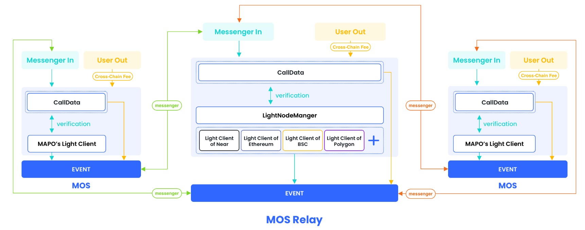

Cross-chain messaging, also known as cross-chain communication or cross-chain interaction, refers to the process of transferring and exchanging information or data between different blockchain networks. The goal of cross-chain technology is to achieve interoperability between different blockchain networks, enabling them to collaborate and exchange value without the need for intermediaries.

Here are some key concepts and points related to cross-chain messaging:

+ Different Blockchain Networks: Cross-chain messaging typically involves different blockchain networks, each with its own blockchain protocols, consensus mechanisms, and smart contract platforms.

+ Information Transfer: Cross-chain messaging can include the transfer and sharing of information, transactions, smart contracts, or other data between different blockchains. This information can include ownership of assets, transaction history, smart contract states, and more.

+ Interoperability: The key goal is to achieve interoperability so that different blockchains can understand and process each other's data and transactions. This may require the establishment of common standards or protocols to ensure the consistency and reliability of information.

+ Cross-Chain Bridges: Cross-chain bridges are technical components that connect different blockchain networks. They allow assets to be locked on one chain and released when needed on another. This is one of the key tools to enable cross-chain communication. MAPO uses light-client technology to build cross-chain infrastructure, enabling trustless and decentralized verification of cross-chain state.

+ Asset Transfer: A common use case for cross-chain messaging is transferring assets from one blockchain to another. This can be used for cross-chain payments, exchanges, and other cross-chain transactions.

+ Security and Trust: Cross-chain communication requires consideration of security and trust issues, as different blockchain networks may have different security features and consensus mechanisms. Ensuring the security of cross-chain interactions is crucial.

Cross-chain messaging technology is becoming an important development direction in the blockchain space because it can break down barriers between separate blockchain networks, enabling them to work together more effectively, expand application scenarios, provide more financial and non-financial services, and enhance the interoperability of the entire blockchain ecosystem. Successfully implementing cross-chain communication has the potential to drive widespread adoption of blockchain technology.

## MAPO implement cross-chain-message

MAP Protocol uses lightweight clients (light-clients) to facilitate cross-chain message delivery. Let's take an example of cross-chain messaging between chains A and B`[A <--> B]`. Here are the specific steps:

 

+ Message Creation: When a cross-chain message is generated on the source chain (Chain A), it gets included in a block on that chain and is broadcasted to the entire network. The MAP Protocol's [MOS](/docs/base/mos/index_en.md) layer provides a standard cross-chain messaging interface called [transferOut](https://github.com/mapprotocol/mapo-service-contracts/blob/main/evm/contracts/interface/IMOSV3.sol#L45). This interface allows users to define messages that need to be sent cross-chain. A contract [transaction](/docs/base/transactions/index_en.md) using this interface will be fully moved to the target chain (Chain B) through the MAP Protocol, where it can be executed by upper-layer applications.

+ Cross-Chain Transaction Submission: Once a cross-chain message transaction is included in a block on the source chain (Chain A), the MAP Protocol's [Compass service (Messenger)](/docs/base/Compass/index_en.md) monitors the transaction and submits it, along with its validity proof, to the [MOS layer](/docs/base/mos/index_en.md) of the target chain (Chain B). The MOS layer on the target chain (Chain B) verifies the validity of the cross-chain transaction using a [light client](/docs/base/light-client/index_en.md) deployed on the target chain.

+ Block Header Synchronization: Light clients need to maintain synchronization with the block headers of the source chain to verify whether the message has been included in a block. The MAP Protocol's [Compass service (Maintainer)](/docs/base/Compass/index_en.md) automatically synchronizes the block headers from both the source chain (Chain A) and the target chain (Chain B) to the counterpart's [light client](/docs/base/light-client/index_en.md) to ensure they have the latest state.

+ Cross-Chain Message Verification: [Light clients](/docs/base/light-client/index_en.md) can verify cross-chain messages by checking the block header information from the source chain. They inspect whether the hash of the message to be verified is present in a block.

+ Message Forwarding and Execution: Once a message is verified and confirmed on the source chain, it can be executed on the target chain.

In summary, using light clients, MAP Protocol enables secure and efficient cross-chain message delivery and verification between source and target chains, ensuring the accuracy of data transfer between chains and achieving true cross-chain interoperability.